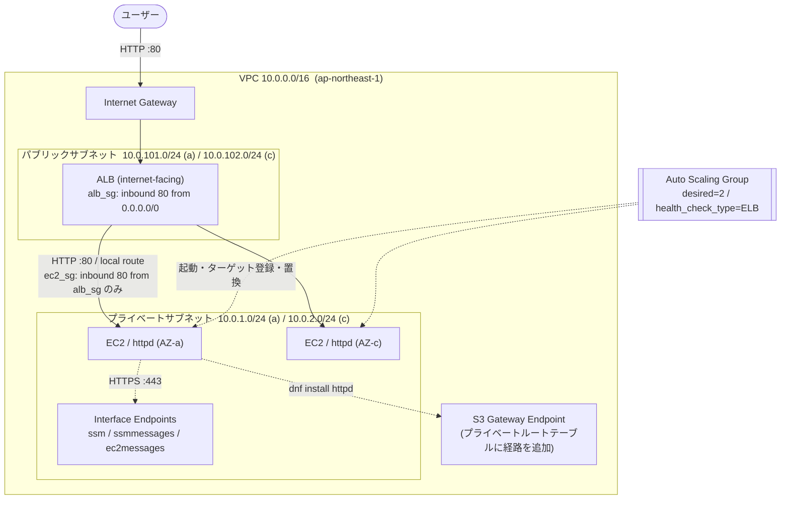

# AWS 3層Webアプリ基盤 (Terraform)

Terraform で構築する、**インターネットに公開しつつサーバーは非公開に保つ**Webアプリケーション基盤です。
ALB を公開層に置き、実際にリクエストを処理する EC2 はパブリックIPを持たないプライベートサブネットに配置します。EC2 は Auto Scaling Group が管理し、アプリケーション層の障害を検知して自動的に入れ替えます。

「動くこと」ではなく **「なぜその構成にしたか」を説明できること** を目的に、設計判断とその理由を [設計判断](#設計判断) に明記しています。

---

## アーキテクチャ



**通信の流れ**

1. ユーザーが ALB の DNS 名にアクセスする（ALB の IP は AWS 側で変動するため、常に DNS 名で参照する）
2. ALB がリクエストを終端し、**新しい TCP 接続を張り直して** EC2 のプライベートIPへ転送する
3. EC2 はパブリックIPを持たないが、同一VPC内の **local ルート** で到達できるため応答できる
4. EC2 から AWS API への通信（SSM・S3）は、インターネットを経由せず **VPCエンドポイント** を通る

---

## 設計判断

このリポジトリの主眼です。それぞれ「他の選択肢もある中で、なぜこれを選んだか」を記載します。

| # | 判断 | 選択 | 理由 |
|---|---|---|---|
| 1 | EC2 の配置 | **プライベートサブネット** | ALB→EC2 は local ルートで成立するため、public/private は通信可否に影響しない。private にするのは**インターネットからの経路そのものを断つ**ため。SGの設定ミスが即座に公開事故にならない多層防御になる |
| 2 | サーバーへの接続手段 | **SSM Session Manager**（SSH廃止） | 22番ポートの開放も鍵の配布・管理も不要。認可を IAM に一元化でき、操作ログも残る。通信は EC2 からのアウトバウンドのみで成立するため、インバウンドルールはゼロ |
| 3 | プライベートサブネットの外部通信 | **VPCエンドポイント**（NAT Gateway 不使用） | NAT Gateway は常時課金される。SSM は Interface エンドポイント3種、パッケージ取得は **S3 Gateway エンドポイント（無料）** で代替でき、インターネット非接続を維持したままコストを抑えられる |
| 4 | EC2 の SG のソース指定 | **`security_groups = [alb_sg.id]`** | ALB のIPは動的に変わるため CIDR で固定できない。SG参照ならIPに依存しない。ALB の SG と EC2 の SG は重複ではなく**多層防御**（SGはリソース単位で、信頼は伝播しない） |
| 5 | 複数リソースの生成 | **`for_each`**（`count` 不使用） | `count` はインデックス管理のため、中間要素の追加が後続リソースの作り直しを引き起こす。`for_each` はキー管理なのでその問題が起きない |
| 6 | EC2 の管理 | **Launch Template + ASG**（`aws_instance` 不使用） | 単一インスタンスでは障害時に手動復旧が必要。ASG なら AZ 分散と自動置換が成立する。個体を修理せず入れ替える運用（Cattle, not Pets）に合わせている |
| 7 | ASG のヘルスチェック | **`health_check_type = "ELB"`** | 既定の `"EC2"` はインスタンスのステータスチェックのみを見るため、**OSは生きているがWebサーバーが死んでいる状態を検知できない**。ALB のヘルスチェック結果を判定に含めることで、アプリケーション層の障害でも自動復旧する |
| 8 | state の管理 | **S3 バックエンド**（`use_lockfile = true`） | state には機密情報が平文で含まれ、機械的なマージもできないため Git 管理は不可。S3 に置くことで共有と排他制御を両立する（Terraform 1.10 以降は DynamoDB 不要） |
| 9 | コードの分割 | **network / compute の2モジュール** | モジュール境界は「**依存が一方通行になる場所**」に引く。network が VPC・サブネットを出力し compute が受け取る片方向の関係で、循環参照が起きない |
| 10 | タグ付け | **`provider` の `default_tags`** | `ManagedBy` / `Project` を全リソースへ自動付与し、各リソースには識別用の `Name` のみを書く。付け忘れが構造的に起きない |

---

## ディレクトリ構成

```
.
├── main.tf                 # provider / backend / module 呼び出し
├── variables.tf            # 入力変数（リージョン・CIDR・インスタンスタイプ等）
├── locals.tf               # 全リソース共通タグ
├── output.tf               # ALB の DNS 名
├── modules/
│   ├── network/            # VPC・サブネット・ルート・IGW・VPCエンドポイント
│   │   ├── main.tf
│   │   ├── variables.tf
│   │   └── outputs.tf
│   └── compute/            # ALB・ターゲットグループ・ASG・起動テンプレート・SG・IAM
│       ├── main.tf
│       ├── variables.tf
│       └── output.tf
└── docs/
    ├── learning-log.md          # 構築の過程と設計判断の記録
    └── before-modularization.tf # モジュール化前の一枚岩構成（学習用アーカイブ）
```

---

## 前提条件

| 項目 | バージョン / 要件 |
|---|---|
| Terraform | 1.15.8（`backend "s3"` の `use_lockfile` を使うため 1.10 以上） |
| AWS Provider | 5.x |
| AWS CLI | 認証情報の設定済み |
| Session Manager Plugin | サーバーへ接続する場合のみ必要 |

**state 保存用の S3 バケットは事前に用意し、[main.tf](main.tf) の `backend` ブロックを自身のバケット名に書き換えてください。** 実行するIAMプリンシパルには、対象バケットへの `s3:ListBucket` とオブジェクトの `Get/Put/Delete` 権限が必要です。

---

## 使い方

```bash
terraform init
```

```bash
terraform plan
```

```bash
terraform apply
```

apply 完了後、ALB の DNS 名が出力されます。

```bash
terraform output -raw alb_dns_name
```

ブラウザで `http://<出力されたDNS名>` を開くと、リクエストを処理した EC2 のホスト名が表示されます。**リロードすると2台の間で切り替わります。**

> HTTPS リスナーは未実装のため、`https://` では接続できません。

### 後片付け

ALB・EC2・Interface エンドポイントは起動している間だけ課金されます。**確認が終わったら破棄してください。**

```bash
terraform destroy
```

---

## 動作確認

### 稼働中のインスタンスを確認する

ASG が起動した EC2 は Terraform の管理外（state に存在しない）ため、タグで検索します。

```bash
aws ec2 describe-instances --filters "Name=tag:Name,Values=portfolio-web_ec2" "Name=instance-state-name,Values=running" --query "Reservations[].Instances[].{ID:InstanceId,AZ:Placement.AvailabilityZone,PrivateIP:PrivateIpAddress}" --output table
```

2台が別々の AZ に配置されていれば、可用性の設計が機能しています。

### サーバーへ接続する

```bash
aws ssm start-session --target <インスタンスID>
```

### 自動復旧を検証する

接続したインスタンス上で Web サーバーを停止させます。

```bash
sudo systemctl stop httpd
```

以下の順に状態が遷移します。

| 経過 | 発生すること |
|---|---|
| 〜60秒 | ALB がまだ健全と判断しており、一部のリクエストが 502 を返す（ヘルスチェック間隔30秒 × 失敗2回で判定するため） |
| 判定後 | ALB が振り分けを停止。**残り1台で応答が正常化**する（この時点でインスタンス自体は稼働したまま） |
| その後 | ASG が該当インスタンスを終了し、**別のプライベートIPを持つインスタンスを起動** |

ASG が実行した操作とその理由は、以下で確認できます。

```bash
aws autoscaling describe-scaling-activities --auto-scaling-group-name portfolio-web_asg --query "Activities[].Cause" --output text
```

`an instance was taken out of service in response to an ELB system health check failure` が記録されていれば、`health_check_type = "ELB"` による自動復旧が機能しています。

---

## 入力変数

| 変数 | 型 | 既定値 | 説明 |
|---|---|---|---|
| `region` | `string` | `ap-northeast-1` | 対象リージョン。AZ名はこの値から導出される |
| `vpc_cidr_block` | `string` | `10.0.0.0/16` | VPC の CIDR |
| `public_subnets` | `map(string)` | `{ a = "10.0.101.0/24", c = "10.0.102.0/24" }` | キーが AZ の末尾文字。ALB を配置 |
| `private_subnets` | `map(string)` | `{ a = "10.0.1.0/24", c = "10.0.2.0/24" }` | キーが AZ の末尾文字。EC2 を配置 |
| `instance_type` | `string` | `t2.micro` | EC2 のインスタンスタイプ |
| `project_name` | `string` | `portfolio-web` | 各リソース名のプレフィックス |

## 出力

| 出力 | 説明 |
|---|---|
| `alb_dns_name` | ALB の DNS 名。ALB の IP は変動するため、必ずこの名前で参照する |

---

## 既知の制約と今後の予定

| 項目 | 内容 |
|---|---|
| スケーリングポリシー未実装 | 現在は `min = desired = max = 2` の固定構成。**可用性は満たすがスケーラビリティは未対応**。負荷に応じた増減を入れるには `max_size` に余裕が必要 |
| データ層が未実装 | RDS を追加し、プライベートサブネットをデータ層としても活用する予定 |
| ログが永続化されていない | インスタンス内のログは入れ替えとともに消える。CloudWatch Logs への転送と CloudTrail 証跡の作成を予定 |
| HTTPS 未対応 | ACM 証明書と 443 リスナー、HTTP からのリダイレクトが未実装 |
| SG の egress が全開放 | 最小権限の観点では必要な宛先・ポートに絞る余地がある |

> このリポジトリを公開する場合、`backend` ブロックのバケット名に AWS アカウントIDが含まれている点にご注意ください。

---

## 構築の記録

構築の過程、つまずいた点、その場で解決した概念上の疑問は [docs/learning-log.md](docs/learning-log.md) に時系列で記録しています。単一 EC2 の最小構成から、変数化・`for_each`・モジュール化・S3 バックエンド・プライベート化・ALB 導入・Auto Scaling までの流れと、各段階での設計判断が追えます。
