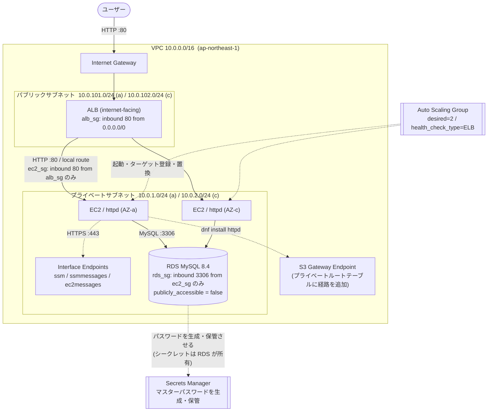

# AWS 3層Webアプリ基盤 (Terraform)

Terraform で構築する、**インターネットに公開しつつサーバーは非公開に保つ**Webアプリケーション基盤です。
ALB を公開層に置き、実際にリクエストを処理する EC2 はパブリックIPを持たないプライベートサブネットに配置します。EC2 は Auto Scaling Group が管理し、アプリケーション層の障害を検知して自動的に入れ替えます。
データ層の RDS (MySQL) も同じプライベートサブネットに置き、EC2 のセキュリティグループからの 3306 番のみを許可します。マスターパスワードは Secrets Manager が生成・保管するため、**Terraform はパスワードを一度も受け取りません**。

「動くこと」ではなく **「なぜその構成にしたか」を説明できること** を目的に、設計判断とその理由を [設計判断](#設計判断) に明記しています。

---

## アーキテクチャ



> ASG と Secrets Manager を VPC の外に描いているのは、これらが**サブネットに存在するリソースではなく、リソースを制御する仕組み**だからです。ASG が起動した EC2 も、Secrets Manager が保管するパスワードも、Terraform の state には現れません。

**通信の流れ**

1. ユーザーが ALB の DNS 名にアクセスする（ALB の IP は AWS 側で変動するため、常に DNS 名で参照する）
2. ALB がリクエストを終端し、**新しい TCP 接続を張り直して** EC2 のプライベートIPへ転送する
3. EC2 はパブリックIPを持たないが、同一VPC内の **local ルート** で到達できるため応答できる
4. EC2 から AWS API への通信（SSM・S3）は、インターネットを経由せず **VPCエンドポイント** を通る
5. EC2 から RDS への通信も同じ local ルートで成立する。RDS は `publicly_accessible = false` かつ SG が EC2 からの 3306 番しか受け付けないため、**VPC の外からは経路そのものが存在しない**

> DB サブネットグループには 1a / 1c の両方を登録していますが、Single-AZ 構成なので **RDS の実体はどちらか一方の AZ にしか存在しません**。サブネットグループは「配置してよい範囲の宣言」であり、「そこ全部に置く」という意味ではありません。

---

## 設計判断

このリポジトリの主眼です。それぞれ「他の選択肢もある中で、なぜこれを選んだか」を記載します。

| # | 判断 | 選択 | 理由 |
|---|---|---|---|
| 1 | EC2 の配置 | **プライベートサブネット** | ALB→EC2 は local ルートで成立するため、public/private は通信可否に影響しない。private にするのは**インターネットからの経路そのものを断つ**ため。SGの設定ミスが即座に公開事故にならない多層防御になる |
| 2 | サーバーへの接続手段 | **SSM Session Manager**（SSH廃止） | 22番ポートの開放も鍵の配布・管理も不要。認可を IAM に一元化でき、操作ログも残る。通信は EC2 からのアウトバウンドのみで成立するため、インバウンドルールはゼロ |
| 3 | プライベートサブネットの外部通信 | **VPCエンドポイント**（NAT Gateway 不使用） | NAT Gateway は常時課金される。SSM は Interface エンドポイント3種、パッケージ取得は **S3 Gateway エンドポイント（無料）** で代替でき、インターネット非接続を維持したままコストを抑えられる |
| 4 | EC2 の SG のソース指定 | **`security_groups = [alb_sg.id]`** | ALB のIPは動的に変わるため CIDR で固定できない。SG参照ならIPに依存しない。ALB の SG と EC2 の SG は重複ではなく**多層防御**（SGはリソース単位で、信頼は伝播しない） |
| 5 | 複数リソースの生成 | **`for_each`**（`count` 不使用） | `count` はインデックス管理のため、中間要素の追加が後続リソースの作り直しを引き起こす。`for_each` はキー管理なのでその問題が起きない |
| 6 | EC2 の管理 | **Launch Template + ASG**（`aws_instance` 不使用） | 単一インスタンスでは障害時に手動復旧が必要。ASG なら AZ 分散と自動置換が成立する。個体を修理せず入れ替える運用（Cattle, not Pets）に合わせている |
| 7 | ASG のヘルスチェック | **`health_check_type = "ELB"`** | 既定の `"EC2"` はインスタンスのステータスチェックのみを見るため、**OSは生きているがWebサーバーが死んでいる状態を検知できない**。ALB のヘルスチェック結果を判定に含めることで、アプリケーション層の障害でも自動復旧する |
| 8 | state の管理 | **S3 バックエンド**（`use_lockfile = true`）＋ **`-backend-config` で環境差分を外出し** | state には機密情報が平文で含まれ、機械的なマージもできないため Git 管理は不可。S3 に置くことで共有と排他制御を両立する（Terraform 1.10 以降は DynamoDB 不要）。なお **`backend` ブロックには変数が使えない**（`init` の時点で必要な設定なので変数の評価が間に合わない）ため、バケット名などの環境依存の値は `backend.hcl` に外出しし、`encrypt` / `use_lockfile` のような**環境に依存しない方針だけをコードに残している** |
| 9 | コードの分割 | **network / compute / database の3モジュール** | モジュール境界は「**依存が一方通行になる場所**」に引く。network が VPC・サブネットを出力し、compute がそれを受けて EC2 の SG を出力し、database がさらにそれを受ける。一方向なので循環参照が起きない |
| 10 | タグ付け | **`provider` の `default_tags`** | `ManagedBy` / `Project` を全リソースへ自動付与し、各リソースには識別用の `Name` のみを書く。付け忘れが構造的に起きない |
| 11 | RDS のマスターパスワード | **`manage_master_user_password = true`**（Secrets Manager に委譲） | `sensitive = true` を付けても state には**平文で保存される**ため、「隠す」というアプローチでは解決しない。Terraform がパスワードを一度も受け取らない構造にし、state に残るのは Secrets Manager の ARN だけにした。**秘密を隠すのではなく、そもそも持たない** |
| 12 | RDS の SG のアウトバウンド | **`egress = []`**（明示的にゼロ） | Terraform は SG 作成時に AWS が自動付与する全許可ルールを削除するため、未記載でも結果は同じ。それでも書くのは、**アウトバウンドがゼロなのは意図なのか記述漏れなのかを、読んだ人が区別できるようにする**ため |
| 13 | ターゲットグループのヘルスチェック | **`health_check` ブロックを明示**（値は既定と同一） | 既定値のままだと「検討した結果その値なのか」「知らなかっただけなのか」が区別できない。インフラの挙動は1ミリも変わらないが、**明示は AWS のためではなく人間のため**。コードを設計判断の記録として扱っている |
| 14 | AWS 任せになっていた決定 | **`identifier` とメンテナンス／バックアップ window を明示** | 未記載なら AWS がインスタンス名を自動生成し、メンテナンスの実行時刻も勝手に選ぶ。明示することで**決定の主体をコード側に取り戻した**。なおウィンドウは「開始してよい枠」であって完了保証ではないため、両者の間に30分のバッファを置いている |

---

## ディレクトリ構成

```
.
├── main.tf                 # provider / backend / module 呼び出し
├── variables.tf            # 入力変数（リージョン・CIDR・インスタンスタイプ等）
├── locals.tf               # 全リソース共通タグ
├── outputs.tf              # ALB の DNS 名 / RDS のホスト名
├── backend.hcl.example     # state 保存先の雛形（実物の backend.hcl は gitignore）
├── modules/
│   ├── network/            # VPC・サブネット・ルート・IGW・VPCエンドポイント
│   │   ├── main.tf
│   │   ├── variables.tf
│   │   └── outputs.tf
│   ├── compute/            # ALB・ターゲットグループ・ASG・起動テンプレート・SG・IAM
│   │   ├── main.tf
│   │   ├── variables.tf
│   │   └── outputs.tf
│   └── database/           # RDS (MySQL)・DBサブネットグループ・SG
│       ├── main.tf
│       ├── variables.tf
│       └── outputs.tf
└── docs/
    ├── learning-log.md          # 構築の過程と設計判断の記録
    └── before-modularization.tf # モジュール化前の一枚岩構成（学習用アーカイブ）
```

---

## 前提条件

| 項目 | バージョン / 要件 |
|---|---|
| Terraform | 1.15.8（`backend "s3"` の `use_lockfile` を使うため 1.10 以上） |
| AWS Provider | 5.x |
| AWS CLI | 認証情報の設定済み |
| Session Manager Plugin | サーバーへ接続する場合のみ必要 |

### state の保存先を指定する

**state 保存用の S3 バケットは事前に用意してください。** バケット名などの環境依存の値は `main.tf` に直接書かず、`backend.hcl` に外出ししています。

```bash
cp backend.hcl.example backend.hcl
```

コピーしたファイルを開き、自身のバケット名に書き換えてください。

```hcl
bucket = "<your-state-bucket-name>"
key    = "terraform.tfstate"
region = "ap-northeast-1"
```

`backend.hcl` は `.gitignore` 済みです。**`backend` ブロックには変数が使えない**（`terraform init` の時点で必要な設定なので、変数の評価が間に合わない）ため、環境ごとの差分はこの仕組みで外から渡します。`main.tf` 側に残しているのは `encrypt` と `use_lockfile` ＝**環境が変わっても変わらない方針**だけです。

### 実行する IAM プリンシパルに必要な権限

EC2 に付与するロールとは**別主体**の話です。「作る権限」と「使う権限」は分かれています。

| 対象 | 必要な権限 | なぜ必要か |
|---|---|---|
| S3（state 保存先） | 対象バケットへの `s3:ListBucket`、オブジェクトへの `Get` / `Put` / `Delete` | backend が state を読み書きするため |
| VPC・EC2・ELB・SSM・IAM | `AmazonEC2FullAccess` / `AmazonSSMFullAccess` / `IAMFullAccess` 相当 | ネットワークと計算層の作成 |
| RDS | `AmazonRDSFullAccess` 相当 | DB インスタンス・サブネットグループの作成 |
| **KMS** | `kms:ListAliases` / `kms:DescribeKey` / `kms:CreateGrant` / `kms:GenerateDataKey` | `storage_encrypted = true` が KMS を使うため。**`AmazonRDSFullAccess` に KMS 権限は含まれていません** |
| **Secrets Manager** | `secretsmanager:CreateSecret` / `DeleteSecret` | `manage_master_user_password = true` がシークレットを作成するため |

> AWS 管理ポリシーは**そのサービスの操作しかカバーしません**。RDS が裏で KMS や Secrets Manager を呼ぶ構成では、呼ばれる側の権限を別途付与する必要があります。
>
> また `DeleteSecret` を落とすと**作れるが片付けられない**状態になります。作成系の権限だけ付けて destroy で詰まるのは頻出の事故なので、削除系も併せて確認してください。

---

## 使い方

```bash
terraform init -backend-config=backend.hcl
```

> **PowerShell の場合は引数を引用符で囲んでください。** `=` の前後で分割され `Too many command line arguments` になります。
>
> ```powershell
> terraform init "-backend-config=backend.hcl"
> ```
>
> `backend.hcl` が必要なのは `init` のときだけです。backend の設定は `.terraform/` に記録されるため、以降の `plan` / `apply` では指定不要です。

```bash
terraform fmt -recursive
```

```bash
terraform validate
```

```bash
terraform plan
```

```bash
terraform apply
```

> `fmt` は既定でカレントディレクトリしか整形しません。モジュール構成では `-recursive` が必要です。

> **apply には10分前後かかります。** 大半は RDS インスタンスの作成待ちです（ALB と EC2 だけなら数分で終わります）。止まったように見えても待ってください。

apply 完了後、ALB の DNS 名と RDS のホスト名が出力されます。

```bash
terraform output -raw alb_dns_name
```

ブラウザで `http://<出力されたDNS名>` を開くと、リクエストを処理した EC2 のホスト名が表示されます。**リロードすると2台の間で切り替わります。**

> HTTPS リスナーは未実装のため、`https://` では接続できません。

### 後片付け

ALB・EC2・Interface エンドポイントは起動している間だけ課金されます。**確認が終わったら破棄してください。**

```bash
terraform destroy
```

---

## 動作確認

### 稼働中のインスタンスを確認する

ASG が起動した EC2 は Terraform の管理外（state に存在しない）ため、タグで検索します。

```bash
aws ec2 describe-instances --filters "Name=tag:Name,Values=portfolio-web_ec2" "Name=instance-state-name,Values=running" --query "Reservations[].Instances[].{ID:InstanceId,AZ:Placement.AvailabilityZone,PrivateIP:PrivateIpAddress}" --output table
```

2台が別々の AZ に配置されていれば、可用性の設計が機能しています。

### サーバーへ接続する

```bash
aws ssm start-session --target <インスタンスID>
```

### 自動復旧を検証する

接続したインスタンス上で Web サーバーを停止させます。

```bash
sudo systemctl stop httpd
```

以下の順に状態が遷移します。

| 経過 | 発生すること |
|---|---|
| 〜60秒 | ALB がまだ健全と判断しており、一部のリクエストが 502 を返す（ヘルスチェック間隔30秒 × 失敗2回で判定するため） |
| 判定後 | ALB が振り分けを停止。**残り1台で応答が正常化**する（この時点でインスタンス自体は稼働したまま） |
| その後 | ASG が該当インスタンスを終了し、**別のプライベートIPを持つインスタンスを起動** |

ASG が実行した操作とその理由は、以下で確認できます。

```bash
aws autoscaling describe-scaling-activities --auto-scaling-group-name portfolio-web_asg --query "Activities[].Cause" --output text
```

`an instance was taken out of service in response to an ELB system health check failure` が記録されていれば、`health_check_type = "ELB"` による自動復旧が機能しています。

### データ層に接続する

マスターパスワードは Secrets Manager が保管しているため、まず取り出します。**このパスワードは Terraform の state には存在しません。**

```bash
aws rds describe-db-instances --db-instance-identifier portfolio-web-db --query "DBInstances[0].MasterUserSecret.SecretArn" --output text
```

```bash
aws secretsmanager get-secret-value --secret-id <上で得たARN> --query SecretString --output text
```

接続先のホスト名を出力から取得します。

```bash
terraform output -raw rds_hostname
```

SSM で EC2 に入り、MySQL クライアントを導入して接続します。**このインスタンスはインターネットに出られませんが、パッケージは S3 Gateway エンドポイント経由でリポジトリから取得できます。**

```bash
sudo dnf install -y mariadb105
```

```bash
mysql -h <rds_hostname> -u admin -p
```

```sql
SHOW DATABASES;
```

`portfolio_web_db` が一覧に表示されれば、`db_name` で指定したデータベースが作成されています。他の4つは MySQL が管理用に持つシステムデータベースです。

確認が終わったら、**`exit` を2回**打って手元の端末まで戻ります。ここでシェルが3階層になっているので、どこにいるかを意識してください。

```
手元の端末
 └─ SSM セッション（EC2）
     └─ mysql クライアント
```

### 到達できないことを確認する

**手元の PC から**同じホスト名を名前解決してみます。

```bash
nslookup <rds_hostname>
```

**プライベートIP（`10.0.x.x`）が返ります。** パブリック DNS が VPC 内のアドレスを答えるので、ホスト名もアドレスも秘密ではありません。それでも接続はできません。

Windows (PowerShell) の場合:

```powershell
Test-NetConnection <rds_hostname> -Port 3306
```

macOS / Linux の場合:

```bash
nc -zv <rds_hostname> 3306
```

`TcpTestSucceeded : False`（`nc` なら接続タイムアウト）になります。**このデータ層を守っているのは情報の秘匿ではなく、経路の遮断です。** 数分前まで EC2 から実際にクエリを流していた相手に、手元の端末からは届きません。

---

## 入力変数

| 変数 | 型 | 既定値 | 説明 |
|---|---|---|---|
| `region` | `string` | `ap-northeast-1` | 対象リージョン。AZ名はこの値から導出される |
| `vpc_cidr_block` | `string` | `10.0.0.0/16` | VPC の CIDR |
| `public_subnets` | `map(string)` | `{ a = "10.0.101.0/24", c = "10.0.102.0/24" }` | キーが AZ の末尾文字。ALB を配置 |
| `private_subnets` | `map(string)` | `{ a = "10.0.1.0/24", c = "10.0.2.0/24" }` | キーが AZ の末尾文字。EC2 を配置 |
| `instance_type` | `string` | `t3.micro` | EC2 のインスタンスタイプ。t2 より新しい世代で単価・性能とも有利なため t3 を既定にしている |
| `project_name` | `string` | `portfolio-web` | 各リソース名のプレフィックス |

## 出力

| 出力 | 説明 |
|---|---|
| `alb_dns_name` | ALB の DNS 名。ALB の IP は変動するため、必ずこの名前で参照する |
| `rds_hostname` | RDS のホスト名。ポートを含む `endpoint` ではなく `address` を出力しているため、`mysql -h` にそのまま渡せる |

---

## 既知の制約と今後の予定

| 項目 | 内容 |
|---|---|
| スケーリングポリシー未実装 | 現在は `min = desired = max = 2` の固定構成。**可用性は満たすがスケーラビリティは未対応**。負荷に応じた増減を入れるには `max_size` に余裕が必要 |
| RDS が Single-AZ | `multi_az = false`。稼働時間の短い学習環境のためコストを優先した。本番では AZ 障害対策に加え、**計画メンテナンス時のダウンタイム短縮**のために `true` にすべき |
| バックアップ保持が1日 | `backup_retention_period = 1`。ポイントインタイムリカバリで戻せる範囲が24時間しかない。本番では RPO の要件に応じて延ばす |
| ログが永続化されていない | インスタンス内のログは入れ替えとともに消える。CloudWatch Logs への転送と CloudTrail 証跡の作成を予定 |
| HTTPS 未対応 | ACM 証明書と 443 リスナー、HTTP からのリダイレクトが未実装。**独自ドメインの取得が前提になる**ため、学習環境では優先度を下げた |
| SG の egress が全開放 | RDS は `egress = []` だが、EC2・ALB・VPCエンドポイントの SG は `0.0.0.0/0` のまま。EC2 は VPCエンドポイントとリポジトリへの通信が必要なので完全には閉じられないが、**443 と VPC CIDR に絞る余地がある** |
| **AMI を固定していない** | `data "aws_ami"` の `most_recent = true` と起動テンプレートの `version = "$Latest"` により、新しい AMI が公開されると**次に起動するインスタンスから世代が変わる**（同一 ASG 内で世代が混ざりうる）。常に最新のパッチで起動できる利点と引き換えに再現性を失っている。本番では AMI ID を変数として固定し、更新は instance refresh で意図的に行うべき |
| **httpd を起動のたびにインストールしている** | `user_data` で `dnf install` するため、**起動が遅く、リポジトリへの到達性に依存する**（起動直後はヘルスチェックを通らない）。事前に焼き込んだ AMI にすれば解消するが、AMI をビルド・管理する仕組みが必要になる。配信物が静的ページ1枚の現状では見合わないと判断した |


---

## 構築の記録

構築の過程、つまずいた点、その場で解決した概念上の疑問は [docs/learning-log.md](docs/learning-log.md) に時系列で記録しています。単一 EC2 の最小構成から、変数化・`for_each`・モジュール化・S3 バックエンド・プライベート化・ALB 導入・Auto Scaling までの流れと、各段階での設計判断が追えます。
